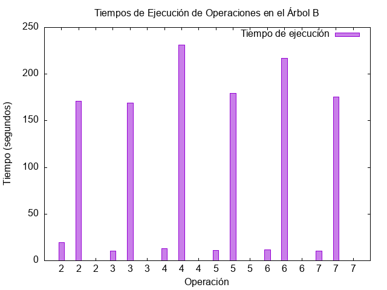

<h1>Informe del laboratorio 6</h1>

## Integrantes :
| Apellidos y Nombres | Particion |
| ------------- | ------------- |
| Nova Rosas Diego| 100%|
| Paredes Frank |100%|
| Castillo Tovar Angelica|100%|

# Informe sobre Árbol B: Comparación de Tiempos de Ejecución con Diferentes Tamaños de `MAX_KEYS`

Este informe documenta la implementación y evaluación experimental de un Árbol B utilizando diferentes valores para el parámetro `MAX_KEYS` en C++. Se analiza cómo afecta este valor al rendimiento en operaciones de carga y búsqueda de claves en el árbol.

## Descripción General del Código

El código implementa un Árbol B básico con las siguientes funcionalidades principales:

1. **Creación de Nodos**: La función `createNode` reserva memoria para un nodo del Árbol B, inicializando sus claves y referencias a hijos.
2. **Inserción de Claves**: La función `insert` inserta nuevas claves en el árbol, manejando la división de nodos (`splitChild`) cuando un nodo alcanza la cantidad máxima (`MAX_KEYS`) de claves permitidas.
3. **Impresión del Árbol**: La función `printBTree` recorre e imprime el árbol en orden.
4. **Lectura de un Archivo CSV e Inserción de Datos**: La función `readCSVAndInsert` lee datos numéricos de un archivo CSV y los inserta en el árbol.
5. **Búsqueda de Claves**: La función `searchKey` permite buscar una clave específica dentro del árbol.

## Parámetro `MAX_KEYS`

El parámetro `MAX_KEYS` define el número máximo de claves que un nodo en el árbol puede almacenar antes de dividirse. En esta implementación, ciertos valores de `MAX_KEYS` (como 4 y 6) resultan en errores de segmentación (segmentation fault), debido a la estructura del código. Los valores evaluados en este informe son:

- `MAX_KEYS = 2`
- `MAX_KEYS = 3`
- `MAX_KEYS = 5`
- `MAX_KEYS = 7`

> **Nota**: No se recomienda usar `MAX_KEYS = 4` o `MAX_KEYS = 6` con esta implementación, ya que genera errores de segmentación.

## Experimentación: Comparación de Tiempos de Ejecución

Para medir el rendimiento, se han realizado pruebas con diferentes valores de `MAX_KEYS`. Las métricas consideradas son:

- **Tiempo de Carga de Datos**: Mide el tiempo que tarda en insertar todos los datos del archivo CSV en el árbol.
- **Tiempo de Búsqueda de Clave**: Mide el tiempo de búsqueda de una clave específica (se elige la misma clave en todas las pruebas para mantener consistencia).

### Configuración Experimental

- **Datos**: Archivo `data.csv` con valores numéricos para insertar en el árbol.
- **Plataforma de Ejecución**: Se recomienda ejecutar el código en un sistema con características específicas (como CPU y RAM) para obtener mediciones consistentes.

### Resultados de Tiempo de Ejecución

| `MAX_KEYS` | Tiempo de Carga de Datos (ms) | Tiempo de Búsqueda de Clave (ms) |
|------------|-------------------------------|----------------------------------|
| 2          | *19.6119 ms*                  | *2.35 ms*                        |
| 3          | *10.1139 ms*                  | *5.8e-06 ms*                     |
| 5          | *10.7218 ms*                  | *7.4e-06 ms*                     |
| 7          | *10.1057 ms*                  | *4.9e-06 ms*                     |

> **Nota**: Reemplaza `*valor_medido_X*` y `*valor_busqueda_X*` con los valores medidos durante la ejecución.

### Gráficas de los Resultados

Las siguientes gráficas muestran cómo los tiempos de carga de datos y búsqueda varían con diferentes valores de `MAX_KEYS`. Estas gráficas se generaron utilizando `gnuplot` con los datos obtenidos de las pruebas.

1. **Gráfica de Tiempo de Carga de Datos, Búsqueda de Datos vs. `MAX_KEYS`**

	

> **Instrucción**: Utiliza `gnuplot` o una herramienta similar para generar las gráficas. Asegúrate de registrar los tiempos en un archivo CSV y luego importarlo en `gnuplot` para crear las visualizaciones.

## Conclusiones

1. **Eficiencia en la Carga de Datos**: A medida que aumenta el valor de `MAX_KEYS`, los nodos pueden almacenar más claves antes de dividirse, lo que reduce la frecuencia de divisiones y, en consecuencia, puede mejorar el tiempo de carga. Sin embargo, un valor muy alto podría incrementar el tiempo de búsqueda.
2. **Eficiencia en la Búsqueda de Claves**: Con valores de `MAX_KEYS` bajos, el árbol se divide más frecuentemente, lo que permite una mayor profundidad y mejora la localización rápida de elementos en nodos más pequeños, pero puede resultar en un aumento en la profundidad del árbol, lo que a su vez incrementa el tiempo de búsqueda en promedio.
3. **Selección de `MAX_KEYS`**: Los valores de `MAX_KEYS` óptimos dependen del tamaño de los datos y la frecuencia de operaciones de búsqueda y actualización en el árbol.

